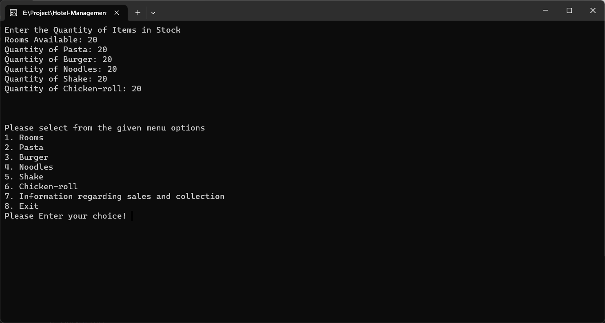
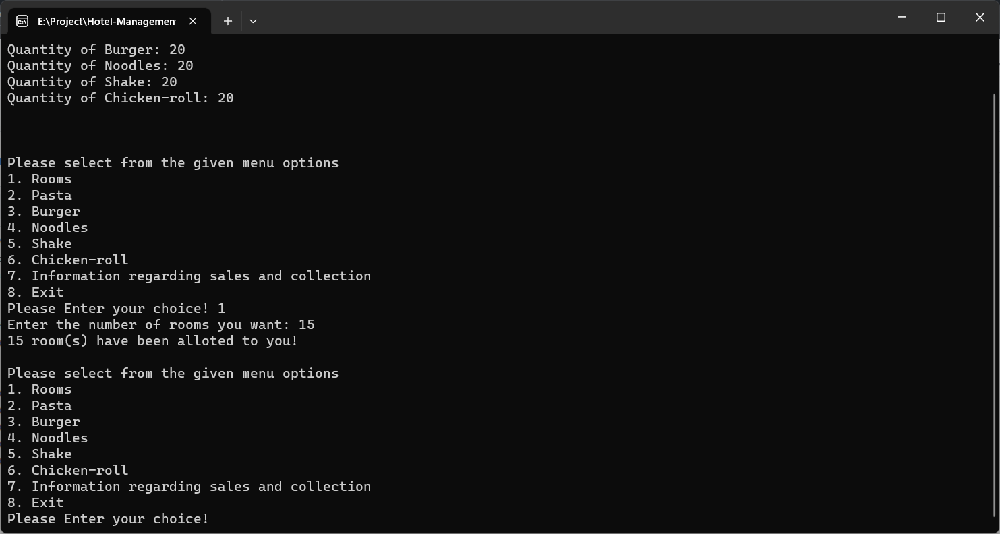
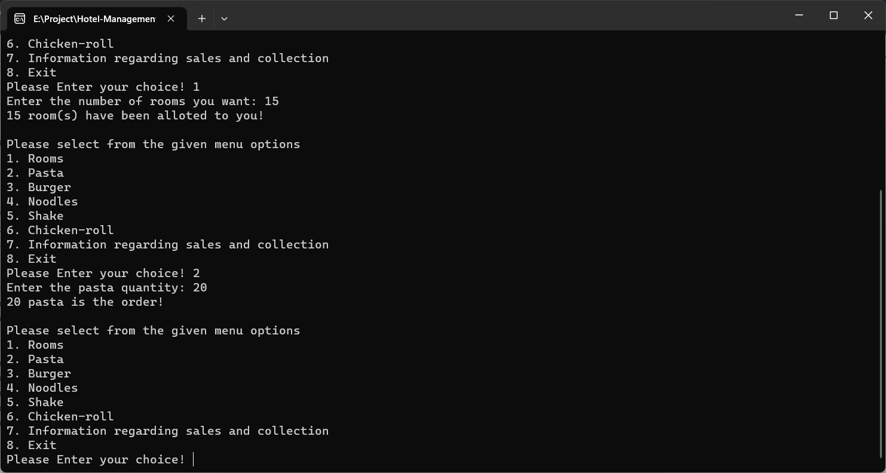
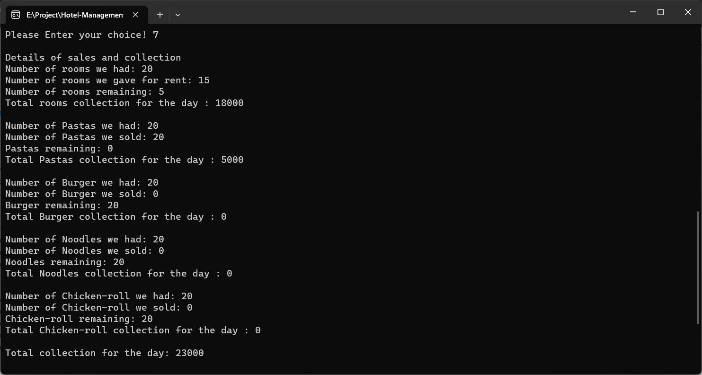

#  C++-Based Hotel Management System 
This project is an all-encompassing and user-friendly hotel management system designed to simplify room booking and food ordering procedures. It has been created using the C++ programming language.

## 📋 Features 📋
This project consists of two primary modules: room management and food management.

Room Management Module: Within this module, users have the capability to perform a range of tasks, including:

*Making room reservations
*Accessing and modifying customer information
*Modifying or canceling reservations
*Checking room availability status
Food Management Module: In the food management module, users can place food orders from a menu that offers a variety of choices, such as:

*Pasta
*Burgers
*Noodles
*Shakes
*Chicken rolls
Additionally, the project provides comprehensive information on sales and revenue collection for both room reservations and food orders
## 📸 Screenshots 📸

## 🎰Technologies 🎰
The project leverages object-oriented programming through the use of classes and employs file handling techniques to effectively store and manipulate customer, room, and food data. It further enhances the user experience by incorporating intuitive menus and interfaces. Notably, the project includes robust input validation procedures, ensuring that users receive clear and informative feedback for both erroneous inputs and successful operations.

## 🚀 How to run 🚀
The project can be compiled and executed using any C++ compiler such as g++ or Visual Studio.

To compile the project using g++, run the following command in the terminal:

`g++ hotel.cpp -o hotel`

To run the project, run the following command in the terminal:

`./hotel`.
